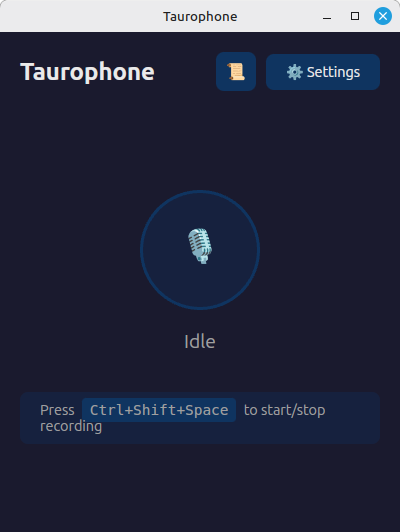

# Taurophone 🎤

System-wide speech-to-text desktop app powered by [OpenAI Whisper API](https://platform.openai.com/docs/guides/speech-to-text).  
Built with **Tauri 2.0** (Rust) + **React** + **TypeScript**.




## Download

**[⬇️ Download latest release](https://github.com/magelix/taurophone/releases/latest)**

Available as AppImage for Linux x86_64. Download, make executable, run:

```bash
chmod +x Taurophone-*.AppImage
./Taurophone-*.AppImage
```

## Features

- 🎙️ **Global hotkey** — Start/stop recording with `Ctrl+Shift+Space` (configurable)
- ⌨️ **Double-tap trigger** — Double-tap `Ctrl`, `Shift`, or `Super/Meta` key to toggle recording
- 📋 **Text injection** — Transcribed text is automatically pasted into the active text field
- 📜 **History** — Browse and copy past transcriptions
- 🌍 **Multi-language** — German, English, French, Italian
- 🎨 **Dark theme** — Easy on the eyes
- ⚙️ **Configurable** — Choose your microphone, language, hotkey, and trigger mode

## How it works

1. Press your configured hotkey or double-tap your trigger key
2. Speak — the app records from your microphone
3. Press again to stop — audio is sent to OpenAI Whisper API
4. Transcribed text is automatically typed into whatever text field has focus

### Double-tap mode

Instead of a key combination, you can configure Taurophone to listen for a quick double-tap of a single modifier key:

| Mode | Trigger |
|---|---|
| Double-tap Ctrl | Tap `Ctrl` twice within 400ms |
| Double-tap Shift | Tap `Shift` twice within 400ms |
| Double-tap Super | Tap `Super`/`Meta`/`⌘` twice within 400ms |

This works similar to macOS dictation (double-tap Fn).

## Setup

1. Get an [OpenAI API key](https://platform.openai.com/api-keys)
2. Launch Taurophone
3. Click **⚙️ Settings**
4. Enter your API key
5. Choose your preferred trigger mode, language, and microphone
6. Close settings — you're ready to go!

## Build from source

### Prerequisites

**Linux (Debian/Ubuntu):**

```bash
# System packages
sudo apt-get install -y \
  libgtk-3-dev \
  libwebkit2gtk-4.1-dev \
  libayatana-appindicator3-dev \
  librsvg2-dev \
  libasound2-dev \
  libssl-dev \
  xdotool

# Rust
curl --proto '=https' --tlsv1.2 -sSf https://sh.rustup.rs | sh

# Tauri CLI
cargo install tauri-cli

# Node.js (v18+)
# https://nodejs.org/
```

### Build

```bash
git clone https://github.com/magelix/taurophone.git
cd taurophone
npm install
cargo tauri build
```

The built AppImage/deb/rpm will be in `src-tauri/target/release/bundle/`.

### Development

```bash
cargo tauri dev
```

## Tech Stack

| Component | Technology |
|---|---|
| Framework | [Tauri 2.0](https://v2.tauri.app/) |
| Backend | Rust |
| Frontend | React + TypeScript + Vite |
| Audio | cpal (cross-platform) |
| Transcription | OpenAI Whisper API (whisper-1, ~$0.006/min) |
| Clipboard | arboard |
| Global keys | rdev + tauri-plugin-global-shortcut |

## Platform Support

| Platform | Status |
|---|---|
| Linux (X11) | ✅ Supported |
| Linux (Wayland) | ⚠️ Partial (global hotkeys may not work) |
| macOS | 🔜 Planned |
| Windows | 🔜 Planned |

## License

MIT
